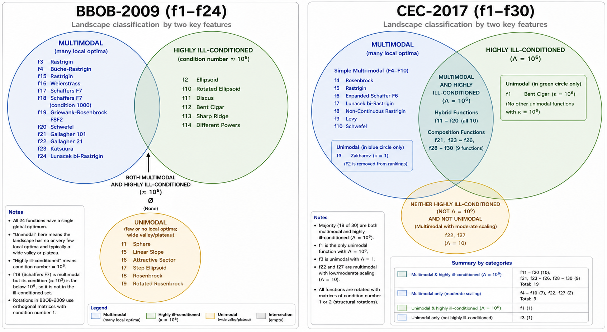

<p align="center">
  
</p>

## In Search of the Best Derivative-Free Optimization Algorithm

Do we need complex modern optimization algorithms?

The "CMA" part in "CMAES" solves badly scaled non-separable cost functions (ill-conditioning), see e.g. [Issue 356](https://github.com/CMA-ES/pycma/issues/356). However, if one's variables are proper, the ES part is literally this code:

```python
import numpy as np

class CWALK:
    def __init__(self, D, x0=None, sigma=1.0, lam=None, rng=None):
        self.D = D
        self.rng = np.random.default_rng() if rng is None else rng

        if x0 is None:
            raise ValueError("x0 must be provided by the driver script.")

        self.xmean = np.asarray(x0, dtype=float).copy()
        self.sigma = float(sigma)

        self.lam = 100 * D if lam is None else int(lam)
        self.mu = self.lam // 2

        self.best_x = self.xmean.copy()
        self.best_f = np.inf

    # ------------------------------------------------------------
    # ASK
    # ------------------------------------------------------------
    def ask(self):
        self.Z = self.rng.standard_normal((self.lam, self.D))
        X = self.xmean + self.sigma * self.Z
        return X

    # ------------------------------------------------------------
    # TELL
    # ------------------------------------------------------------
    def tell(self, X, fitness, sigma):
        X = np.asarray(X, dtype=float)
        fitness = np.asarray(fitness, dtype=float)
        order = np.argsort(fitness)

        # best-so-far
        if fitness[order[0]] < self.best_f:
            self.best_f = float(fitness[order[0]])
            self.best_x = X[order[0]].copy()

        # update mean
        self.xmean = np.mean(X[order[:self.mu]], axis=0)
        self.normz = np.linalg.norm(np.mean(self.Z[order[:self.mu]], axis=0))

        # update sigma
        if sigma is not None:
            self.sigma = sigma
```

Believe it or not, the code solves the rotated Lunacek bi-Rastrigin (F24 BBOB-2009). This is where all the intricate Newton/Powell methods fail, including the MCS and Nomad.

## Setup

```
git clone https://github.com/aabbtree77/cwalk.git
cd cwalk

uv venv

source .venv/bin/activate

uv pip install \
    numpy \
    scipy \
    matplotlib \
    cma \
    coco-experiment \
    ipython \
    minionpy
```

## The Good: F24 BBOB-2009

```bash
python3 test_bbob2009.py

Problem
----------------------------------------
Backend : BBOB
Name    : bbob_f024_i01_d40
D       : 40
Bounds  : [-5.0, 5.0] for every coordinate
fopt    : 102.61
Created : 2026-07-27 00:29:20

Initial sigma : 1
evals=    100000 best_f=5.299968e+02 error=4.273868e+02 sigma=8.017e-01
evals=    200000 best_f=4.000308e+02 error=2.974208e+02 sigma=6.368e-01
evals=    300000 best_f=3.666502e+02 error=2.640402e+02 sigma=5.058e-01
evals=    400000 best_f=3.473649e+02 error=2.447549e+02 sigma=4.018e-01
evals=    500000 best_f=3.265643e+02 error=2.239543e+02 sigma=3.192e-01
evals=    600000 best_f=3.240048e+02 error=2.213948e+02 sigma=2.535e-01
evals=    700000 best_f=3.240048e+02 error=2.213948e+02 sigma=2.014e-01
evals=    800000 best_f=3.240048e+02 error=2.213948e+02 sigma=1.600e-01
evals=    900000 best_f=3.240048e+02 error=2.213948e+02 sigma=1.271e-01
evals=   1000000 best_f=3.240048e+02 error=2.213948e+02 sigma=1.009e-01
evals=   1100000 best_f=3.240048e+02 error=2.213948e+02 sigma=8.017e-02
evals=   1200000 best_f=3.240048e+02 error=2.213948e+02 sigma=6.368e-02
evals=   1300000 best_f=3.121135e+02 error=2.095035e+02 sigma=5.058e-02
evals=   1400000 best_f=3.013288e+02 error=1.987188e+02 sigma=4.018e-02
evals=   1500000 best_f=2.701156e+02 error=1.675056e+02 sigma=3.192e-02
evals=   1600000 best_f=2.091583e+02 error=1.065483e+02 sigma=2.535e-02
evals=   1700000 best_f=1.721276e+02 error=6.951763e+01 sigma=2.014e-02
evals=   1800000 best_f=1.526473e+02 error=5.003727e+01 sigma=1.600e-02
evals=   1900000 best_f=1.316534e+02 error=2.904339e+01 sigma=1.271e-02
evals=   2000000 best_f=1.206309e+02 error=1.802090e+01 sigma=1.009e-02
evals=   2100000 best_f=1.119537e+02 error=9.343675e+00 sigma=8.017e-03
evals=   2200000 best_f=1.104614e+02 error=7.851370e+00 sigma=6.368e-03
evals=   2300000 best_f=1.074570e+02 error=4.847032e+00 sigma=5.058e-03
evals=   2400000 best_f=1.054741e+02 error=2.864093e+00 sigma=4.018e-03
evals=   2500000 best_f=1.047269e+02 error=2.116855e+00 sigma=3.192e-03
evals=   2600000 best_f=1.039641e+02 error=1.354105e+00 sigma=2.535e-03
evals=   2700000 best_f=1.035237e+02 error=9.137222e-01 sigma=2.014e-03
evals=   2800000 best_f=1.032888e+02 error=6.788106e-01 sigma=1.600e-03
evals=   2900000 best_f=1.031278e+02 error=5.178318e-01 sigma=1.271e-03
evals=   3000000 best_f=1.029578e+02 error=3.478413e-01 sigma=1.009e-03
evals=   3100000 best_f=1.028953e+02 error=2.853422e-01 sigma=8.017e-04
evals=   3200000 best_f=1.028682e+02 error=2.582219e-01 sigma=6.368e-04
evals=   3300000 best_f=1.028322e+02 error=2.222083e-01 sigma=5.058e-04
evals=   3400000 best_f=1.028317e+02 error=2.216639e-01 sigma=4.018e-04
evals=   3500000 best_f=1.028190e+02 error=2.090154e-01 sigma=3.192e-04
evals=   3600000 best_f=1.028112e+02 error=2.012098e-01 sigma=2.535e-04
evals=   3700000 best_f=1.028073e+02 error=1.973345e-01 sigma=2.014e-04
evals=   3800000 best_f=1.028049e+02 error=1.948547e-01 sigma=1.600e-04
evals=   3900000 best_f=1.028034e+02 error=1.934189e-01 sigma=1.271e-04
evals=   4000000 best_f=1.028017e+02 error=1.917442e-01 sigma=1.009e-04

Finished
----------------------------------------
Completed evaluations : 4000000
Requested budget      : 4000000
Best f                : 1.028017441860e+02
fopt                  : 1.026100000000e+02
Error                 : 1.917441860190e-01
Progress saved to     : progress_bbob2009_f24.csv

```

It takes 1e4xD evals to reach 0.2% relative error.

- Reduce budget 10x, reduce lambda 10x, relative error will increase 10x.
- Increase budget 10x, increase lambda 10x, relative error will decrease 100x!

For 1e7xD evals the relative error is still O(1e-5).

lambda=D does not reach the global optimum at all. Anything interesting starts with lambda=10D.

Restart to avoid adversarial initial points. Restarting does not improve precision/convergence. However, it is essential: unlike in CMAES, a zero does not lead to the optimum.

Normality is not essential, but other distributions do not improve optmization.

One can reach relative error O(1e-5) with

```python
self.Z = self.rng.laplace(0.0, 1.0, (self.lam, self.D))
```

or even uniform distribution:

```python
self.Z = self.rng.uniform(-3.0, 3.0, (self.lam, self.D))
```

Uniformity within [-5.0, 5.0] will still work, but [-1.0, 1.0] won't. The scale in the Laplace distribution can go up to 3.0..4.0, but no further.

The choice of the final sigma value at the end of the budget, be it 1e-4 or 1e-6, is not too critical. The choice of the initial sigma value is. For very large budgets sigma can be tiny and constant, otherwise we go with 10% of the biggest coordinate range (from box constraints).

Adding random sigma bursts during the optimization does not improve anything.

Expect to solve a good half of the whole BBOB-2009 with the ES (if not everything except F2, F10 - F14, but these can be done with scipy BFGS).

## The Bad: F12 CEC-2022

```bash
python3 test_cec2022.py

Problem
----------------------------------------
Backend : CEC2022
Name    : CEC2022 f12
D       : 20
Bounds  : [-100.0, 100.0] for every coordinate
fopt    : 2700.0
Created : 2026-07-27 00:53:02

Initial sigma : 20
evals=    100000 best_f=3.078020e+03 error=3.780203e+02 sigma=1.274e+01
evals=    200000 best_f=2.995935e+03 error=2.959349e+02 sigma=8.036e+00
evals=    300000 best_f=2.986139e+03 error=2.861390e+02 sigma=5.070e+00
evals=    400000 best_f=2.986139e+03 error=2.861390e+02 sigma=3.199e+00
evals=    500000 best_f=2.986139e+03 error=2.861390e+02 sigma=2.019e+00
evals=    600000 best_f=2.985843e+03 error=2.858433e+02 sigma=1.274e+00
evals=    700000 best_f=2.985738e+03 error=2.857379e+02 sigma=8.036e-01
evals=    800000 best_f=2.985697e+03 error=2.856973e+02 sigma=5.070e-01
evals=    900000 best_f=2.985667e+03 error=2.856670e+02 sigma=3.199e-01
evals=   1000000 best_f=2.985649e+03 error=2.856490e+02 sigma=2.019e-01
evals=   1100000 best_f=2.985646e+03 error=2.856463e+02 sigma=1.274e-01
evals=   1200000 best_f=2.985643e+03 error=2.856425e+02 sigma=8.036e-02
evals=   1300000 best_f=2.985642e+03 error=2.856422e+02 sigma=5.070e-02
evals=   1400000 best_f=2.985642e+03 error=2.856419e+02 sigma=3.199e-02
evals=   1500000 best_f=2.985642e+03 error=2.856417e+02 sigma=2.019e-02
evals=   1600000 best_f=2.985642e+03 error=2.856417e+02 sigma=1.274e-02
evals=   1700000 best_f=2.985642e+03 error=2.856416e+02 sigma=8.036e-03
evals=   1800000 best_f=2.985642e+03 error=2.856416e+02 sigma=5.070e-03
evals=   1900000 best_f=2.985642e+03 error=2.856416e+02 sigma=3.199e-03
evals=   2000000 best_f=2.985642e+03 error=2.856416e+02 sigma=2.019e-03

Finished
----------------------------------------
Completed evaluations : 2000000
Requested budget      : 2000000
Best f                : 2.985641603543e+03
fopt                  : 2.700000000000e+03
Error                 : 2.856416035435e+02
Progress saved to     : progress_cec2022_f12.csv
```

Most of the state of the art is within 10% from the optimum. I have not seen any algorithm to go below 2900.

## The Ugly: F10 BBOB-2009

"F10 is the Ellipsoidal Function (a high-conditioning, unimodal function). It is hard to optimize because it features an extreme condition number (around 1e6) combined with non-separability, meaning its axes are rotated and scale at vastly different rates."

The ES becomes brittle with ill-conditioning. It still solves these problems, but one needs to increase the budget 1000x, say to a billion evals.

"A very rough rule of thumb is that without CMA, the number of evaluations are proportional to the condition number..." - Nikolaus Hansen, [Issue 356.](https://github.com/CMA-ES/pycma/issues/356)

That number can be proprotional to the condition number squared... The ES reaches f = -29.5 (when fopt = -54.94) on F10 BBOB-2009 in 1B evals with a constant step size 1e-3. After 1M evals it is still at f = 2.61e+07...

After some more thorough testing, see [Minion Issue 11](https://github.com/khoirulmuzakka/Minion/issues/11), it is tempting to resort to BIPOP-aCMAES or ARRDE.

## The Rules of the Game

So this is all about multimodality and ill-conditioning.

The figure above indicates that a large part of BBOB-2009, if not entirely the whole benchmark, can be covered by running any solid Newton (scipy SLSQP/BFGS) with the ES and choosing the better result.

CEC-2017 is a bigger challenge as there are a lot of functions which are both: multimodal and ill-contioned. Except for F22, F24, and F27, F20 - F30 are beyond any known method if we require an optimizer to get close to the global optimum within, say, 1% relative error in 1B evals.

I propose the following benchmark to compress the whole BBOB-2009 and CEC-2017:

```markdown
| Algorithm    | F10 BBOB-2009 | F24 BBOB-2009 | F24 CEC-2017   | F25 CEC-2017   |
| ------------ | ------------- | ------------- | -------------- | -------------- |
| ES           | >1B           | <10M          | >200M (f=2800) | >1B (f=2900)   |
| BIPOP-aCMAES | <50K          | <10M          | =200M (f=2500) | =200M (f=2899) |
| ARRDE        | <500K         | >200M         | >200M (f=2400) | =1B (f=2700)   |
|              |               |               |                | =2B (f=2800)   |
| R6           |               |               |                | =50M (f=2600)  |
```

One could add F7 BBOB-2009 to remove pure Newton/gradient methods, but they will be pathetic on F24s and F25 anyway.

- ES: wipes the floor with Newton/Powell on Rastrigin-like multimodals. Outstanding only with mild condition numbers (up to ~1000, still solves F18 BBOB-2009). It is sensitive w.r.t. starting points.

- BIPOP-aCMAES (pycma CMAES), used to be the best, fails on F24 - F30 CEC-2017 when there is no single coordinate system to rescale and unrotate.

- ARRDE: pushes the frontier, but demands C++ and budgets larger than 1e7xD to differentiate itself from pycma CMAES. It completely solves F24 CEC-2017 (!), yet cannot nail F25 CEC-2017 yet. It is still better than CMAESes even on the F25: ARRDE may reach f = 2700, but this is not stable and even 2B evals often lead to 2800. BIPOP-aCMAES f = 2899. Notably, ARRDE sustains ill-conditioning without matrices.

- R6: my own development (details later). Clearly better than anything out there on F25 CEC-2017, but still does not nail it. Solves F28 CEC-2017 in just 10M evals, and F24 with at least 200M evals.

Scroll down for more benchmarking on CEC-2017.

## Anything Better Out There?

### Newest DEs?

RDEx-SOP is a winner of CEC-2025, but it is tuned for tiny budgets (2e4xD evals). It already has improvements, alternatives.

- Sichen Tao et al. (2026) [RDEx-SOP: Exploitation-Biased Reconstructed Differential Evolution for Fixed-Budget Bound-Constrained Single-Objective Optimization](https://arxiv.org/abs/2603.27089)

- Dikshit Chauhan (2026) [DE-2LS: Differential Evolution with Late-Stage local-search for Unconstrained Single-Objective Numerical Optimization](https://arxiv.org/abs/2606.27762)

- Dikshant et al. (2026) [RDEx-CASK: Cauchy Mutation, Archive, and Stagnation Kick for RDEx-CSOP](https://arxiv.org/abs/2605.09652)

- Tomofumi Kitamura and Alex Fukunaga (2025) [Is Selection All You Need in Differential Evolution?](https://arxiv.org/abs/2506.14425)

The last report includes Table 2 which shows how differential evolution has been improved with about four ideas since 2009 up to 2022. It looks like the progress stalls around 2017, but now it is a new game with AI.

### CMAES Mods?

- Lots of CMAES complications exist, but I could not get anything from them so far, e.g.

  Dimitar Nedanovski et al. (2026) [MSC-CMA-ES: Structure-Aware Restarts for CMA-ES via Cyclic Nearest-Better Basin Discovery](https://arxiv.org/abs/2606.15830), [Github](https://github.com/snenovgmailcom/cma_es_project/tree/main)

  It does not reach f = 2400 on F24 CEC-2017 at all and does not look any different than BIPOP-aCMAES, despite the paper hinting that it could be interesting on the CEC-2017 composites. Very slow even with the C++ acceleration.

  Default parameters, seed = 20260825, F24 CEC-2017 D=20 got precisely f = 2500 in 200M evals, which took about 5 hours to run (a single optimization) on i7 gen4 16GB RAM. The C++ acceleration is only for clustering, pycma CMAES runs inside MSC-CMA-ES.

- Another one bites the dust:

  Khoirul Faiq Muzakka et al. (2026) [RCMAES: A Robust CMA-ES Variant for CEC2026 Competition](https://arxiv.org/abs/2604.27138)

  No difference, except that it is much faster to test than pycma and MSC-CMA-ES and is integrated into [Minion](https://github.com/khoirulmuzakka/Minion).

- LLMs are everywhere now. This one was quite early and used local minimal models to "explain" concrete optimization results after the run. This is not very useful per se, but might stimulate some thinking towards embracing a new world:

  Jill Baumann and Oliver Kramer (2024) [Towards Explainable Evolution Strategies with
  Large Language Models](https://arxiv.org/abs/2407.08331)

- Endless hopeless theory, e.g. indicating that the population size should be O(sqrt(D)xlog(D)):

  Lisa Schönenberger and Hans-Georg Beyer (2023) [On a Population Sizing Model for Evolution Strategies
  Optimizing the Highly Multimodal Rastrigin Function](https://pmc.ncbi.nlm.nih.gov/articles/PMC7615652/)

- Simplifications exist, but I would not recommend them, e.g.

  Zhenhua Li and Qingfu Zhang (2017) [A Simple Yet Efficient Rank One Update for Covariance
  Matrix Adaptation](https://arxiv.org/abs/1710.03996)

  See pycma's [Issue 356](https://github.com/CMA-ES/pycma/issues/356) for some of it in action, also consider adjusting the CSA according to pycma [Issue 231](https://github.com/CMA-ES/pycma/issues/231).

  The problem is, for any such simplification, everything starts anew, e.g. the rank one algorithm is too sensitive/unreliable w.r.t. starting points and initial step sizes on F10 BBOB-2009, while pycma brings no such trouble. The rank one update also does not work with larger lambdas as its simplistic CSA blows up the step size.

  None of this is valuable as we simply lose years of testing and tuning present in pycma. This is why I would also not recommend any custom implementation of CMAESes including the ones by [Minion](https://github.com/khoirulmuzakka/Minion/issues/7).

  Any simplification should be tested on every BBOB-2009 function one by one, with different step sizes, initial points, lambdas.

### Dual Annealing?

scipy includes an algorithm called "dual annealing" (DA) which runs BFGS as local search. Scroll down [this code](https://github.com/sgubianpm/sdaopt/blob/master/sdaopt/_sda.py) for all the references. DA got visible first in the R community.

I did not get anything from DAs on CEC2017 F24 - F30 in D=20. Also tried [this code](https://github.com/DawitLam/Improvements_to_Dual_Annealing_in_SciPy) to no avail.

Minion includes [one interesting comparison](https://minion-py.readthedocs.io/en/stable/l_bfgs_b_notebook.html) between the ARRDE, numerous BFGS implementations, and two DA implementations. It turns out that Minion's DA is worse than scipy DA, except on F17 and F26 (CEC-2017). The ARRDE is clearly better than anything on: F10, F12, F17 (somewhat), F21, F22, F24, F26, F28, and F30. However, in the rest of the cases DAs are close and on F25 scipy DA = 2600 (!), the ARRDE and the rest are close and only around 2900. It is the first time I see the problem where the ARRDE could be clearly worse.

Minion's result in D=10 depends on the starting point and D=10 does not generalize to D=20 at all. According to [Minion's notebook](https://minion-py.readthedocs.io/en/stable/l_bfgs_b_notebook.html), the ARRDE solves F26 CEC-2017 in D=10 in fewer than 100K evals (reaching 2600). In my runs, for the zero starting point, seed = 20260815, the ARRDE reaches only 2800 in 2B evals (F26 CEC-2017 D=20). Night and day.

### BBOB-2009

Nowadays it is much faster to git clone and test an algorithm than [to decipher a pdf report](https://github.com/CMA-ES/pycma/discussions/370), but still interesting to see benchmarks as they indicate what works and what does not.

- Youssef Diouane et al. (2022) [TREGO: a Trust-Region Framework for Efficient Global Optimization](https://arxiv.org/abs/2101.06808)

- Zachary Hoffman and Steve Huntsman (2022) [Benchmarking an algorithm for expensive high-dimensional
  objectives on the bbob and bbob-largescale testbeds](https://hal.science/hal-03665291v1/file/GECCOarXiv2022.pdf)

- Ryoji Tanabe (2022) [Benchmarking the Hooke-Jeeves Method, MTS-LS1, and BSrr on
  the Large-scale BBOB Function Set](https://arxiv.org/abs/2204.13284)

- Nikolaus Hansen (2019) [A Global Surrogate Assisted CMA-ES](https://inria.hal.science/hal-02143961v1/document), [pycma (github)](https://github.com/CMA-ES/pycma), [pycma Issue 356](https://github.com/CMA-ES/pycma/issues/356)

- Nikolaus Hansen at al. (2019) [Real-Parameter Black-Box Optimization Benchmarking 2009: Noiseless Functions Definitions](https://inria.hal.science/inria-00362633v2/document)

- Konstantinos Varelas (2019) [Benchmarking Large Scale Variants of CMA-ES and L-BFGS-B
  on the bbob-largescale Testbed](https://inria.hal.science/hal-02160106/file/wksp213s2-file1.pdf)

- Aurore Blelly at al. (2018) [Stopping Criteria, Initialization, and Implementations of
  BFGS and their Effect on the BBOB Test Suite](https://inria.hal.science/hal-01811588/file/workshop_paper-authorversion.pdf)

## Selected Classics

Early algorithms did not survive the test of time. Analysis, boundary handling did.

- H. H. Rosenbrock (1960) An Automatic Method for Finding the Greatest or Least Value of a Function

- R. Fletcher and M.J.D. Powell (1963) A Rapidly Convergent Descent Method for Minimization

- L.A. Rastrigin (1965) Solution of inverse problems by statistical optimization methods

- M.J. Box (1966) A Comparison of Several Current Optimization Methods, and the use of Transformations in Constrained Problems

- M.A. Schumer and K. Steiglitz (1968) Adaptive step size random search

- L.J. White and R.G. Day (1971) An Evaluation of Adaptive Step-Size Random Search

- J. Mockus, V. Tiesis, A. Zilinskas (1978) The Application of Bayesian Methods for Seeking the Extremum

- J. Bernussou and J. Geromel (1981) An easy way to find gradient matrix of composite matricial functions

- ...

- [CMAES 1996 - 2014](https://cma-es.github.io/)

- ...

- Khoirul Faiq Muzakka, Ahsani Hafizhu Shali, Haris Suhendar, Sören Möller, Martin Finsterbusch (2026) [Robust Differential Evolution via Nonlinear Population Size Reduction and Adaptive Restart: The ARRDE Algorithm](https://arxiv.org/abs/2511.18429v4), [Minion (github)](https://github.com/khoirulmuzakka/Minion), [Minion Issue 11](https://github.com/khoirulmuzakka/Minion/issues/11), [algolist](https://minion-py.readthedocs.io/en/latest/algolist.html)

[Farewell to matrices and convergence proofs.](https://github.com/CMA-ES/pycma/discussions/367)

## Evaluation Budgets

[ARRDE 2026:](https://arxiv.org/pdf/2511.18429)

_"For CEC2017, the algorithm was tested on 29 problems at dimensions 10, 30, 50, and 100, with the maximum number of function evaluations set to Nmax = 10^4 × D. Following the CEC2017 guidelines, problem
F2 (the shifted and rotated Rastrigin function) was excluded due to numerical instability in higher dimensions. For CEC2020, the algorithm was evaluated on 10 problems at dimensions 5, 10, 15, and 20, with the
corresponding evaluation budgets set to Nmax = 5 × 10^4, 10^6, 3 × 10^6, and 10^7. For CEC2022, the algorithm
was tested on 12 problems at dimensions 10 and 20, using Nmax = 2 × 10^5 and 10^6, respectively. It is worth
noting that although the CEC2017 suite contains higher-dimensional problems, it uses substantially lower
evaluation budgets compared with the CEC2020 and CEC2022 suites. Conversely, CEC2020 represents the
opposite extreme: relatively low-dimensional problems paired with exceptionally large evaluation budgets._

_For the CEC2019 100-Digit Challenge, algorithms are evaluated under an effectively unlimited time budget. In this study, we impose a practical limit of Nmax = 10^8. The dimensionality of the problems ranges
from 9 to 18, with most being 10-dimensional. For each problem, the number of correctly retrieved digits (up
to the 10th decimal place) is recorded, and the final ranking is determined based on the average number of
correct digits achieved in the best 25 out of 51 runs._

_The CEC2011 real-world optimization suite comprises 22 problems with dimensionalities ranging from
6 to 212. These problems are derived from simplified formulations of practical engineering tasks, including
FM sound wave parameter estimation, Lennard–Jones and Tersoff potential minimization, spread-spectrum
radar polyphase code design, transmission network expansion planning (TNEP), transmission pricing, circular antenna array design, static and dynamic economic load dispatch (ELD/DED), hydrothermal scheduling, and spacecraft trajectory optimization for the Messenger and Cassini 2 missions. Several of the original
problems include inequality constraints in addition to bound constraints. Since our focus in this study is
on bound-constrained optimization, these inequality constraints are omitted. Despite their simplifications,
many CEC2011 problems remain very challenging due to their high dimensionality and multimodal landscapes. Following the CEC2011 benchmarking protocol, we evaluate all algorithms under three functionevaluation budgets: Nmax = 5 × 10^4
, 10^5, and 1.5 × 10^5."_

Kindergarten budgets, but they still advance the DFO algorithms, paradoxically.

### Testing ARRDE

F25 CEC-2017 D=20, 1B evals: ARRDE f=2700, seed=20260829, single run takes 4.68 hours on i7 gen 4 16GB RAM.

F28 CEC-2017 D=20, <=200M evals: ARRDE f=3000, BIPOP-aCMAES f=3100; fopt = 2800.

F24 CEC-2017:

- restarts are critical, at least O(10) are needed,

- 200M evals are sufficient to solve the problem completely (f=fopt=2400) when the seed is good.

F25 CEC-2017:

- restarts may not be needed,

- 1B evals still do not solve the problem (f=2700, fopt=2500).

Making significant progress on F24 does not imply its transfer on F25 and vice versa.

ARRDE can be inconsistent w.r.t. increasing budgets, e.g. F25 CEC-2017 D=20 seed=20260829:

- 500M evals: f=2800, 
- 1B evals: f=2700, 
- 2B evals: f=2800. 

On F24 CEC-2017, it is picky with seeding or whether zero is included in the initial population.

It is an already very heavily optimized algorithm which adds to the jSO algorithm global phases 
with some intricate refinement machinery via merged local intervals acting as [Tabu Search](https://github.com/zarankumar/tabu-search).

### Results with Selected CEC-2017 Composites

D=20, seed=20260829, 200M evals.

| Place | Algorithm      | F24   | F25   | F28   |
|-------|----------------|-------|-------|-------|
| 1     | R6             | 2438  | 2600  | 2804  |
| 2     | ARRDE          | 2400  | 2899  | 3000  |
| 3     | BIPOP-aCMAES   | 2800  | 2910  | 3100  |

- R6: solves F24, F28, makes significant progress on F25 (in just 50M evals).

- ARRDE: solves F24. Can be pushed to 2700 on F25 with 500M-2B evals.

- BIPOP-aCMAES lags already on F21 and F22 (not shown here, stays ~2300 in the both cases).

Not much progress with F21-F23 (F22 looks solvable beyond 200M evals), F26, F27, F29, F30, but I also did not spend enough time on these. Every cost function is a separate world. 

One can do runs with 5B evals testing for months without going further than BIPOP-aCMAES which is a very smart algorithm. All of the composites are tough cases. 

Notice that the ARRDE is a recent algorithm (2026) and it is probably the only one that has finally managed to improve pycma BIPOP-aCMAES for real, and the CMAES itself is decades of research. R6 improves ARRDE.

When looking at the content of these composites (see the lists below), the usual suspect could be modified Schwefel's function. However, F22 CEC-2017 is solvable, so focusing on that function alone might be dubious.

## CEC-2017 Composites

These are the hardest cost functions of the benchmark. Do not run anything classical on them. All of the 3rd and 4th generation DEs fail on them. I have verified this with [Minion](https://github.com/khoirulmuzakka/Minion).

What are these challenges?

Firstly, the subsets of already deceptive functions (in each given list) are mixed into hybrids.

In turn, these hybrids are rotated and scaled with different matrices and further mixed with some distance based weighing.

Any single function is often already deceptive: multimodal, sometimes non-differentiable. It can already be ill-conditioned before being mixed into a hybrid. The latter in turn will get their own ill-conditioning.

There are separate research works with a deep focus on some of them, see e.g. [Happy Cat Function](https://www.researchgate.net/publication/234024034_HappyCat_-_A_Simple_Function_Class_Where_Well-Known_Direct_Search_Algorithms_Do_Fail) which is a deceptive ridge generator designed to obfuscate ES and DE searches.

F30:

1. Rastrigin's Function
2. Griewank's Function
3. Schaffer’s F6 Function
4. Rosenbrock's Function
5. Katsuura Function
6. Ackley's Function
7. Expanded Griewank's plus Rosenbrock's Function
8. Modified Schwefel's Function

F29:

1. Rastrigin's Function
2. Griewank's Function
3. Schaffer’s F6 Function
4. Rosenbrock's Function
5. High Conditioned Elliptic Function
6. Ackley's Function
7. HGBat Function
8. Discus Function
9. Bent Cigar Function
10. Expanded Griewank's plus Rosenbrock's Function
11. Weierstrass Function


F28:

1. Rastrigin's Function
2. Griewank's Function
3. Rosenbrock's Function
4. Schaffer’s F6 Function
5. Katsuura Function
6. Ackley's Function

F27:

1. HGBat Function
2. Rastrigin's Function
3. Modified Schwefel's Function
4. Bent-Cigar Function
5. High Conditioned Elliptic Function
6. Expanded Schaffer's F6 Function

F26:

1. Expanded Schaffer's F6 Function
2. Modified Schwefel's Function
3. Griewank's Function
4. Rosenbrock's Function
5. Rastrigin's Function

F25:

1. Rastrigin's Function
2. Happy Cat Function
3. Ackley's Function
4. Discus Function
5. Rosenbrock's Function

F24:

1. Ackley's Function
2. High Conditioned Elliptic Function
3. Griewank's Function
4. Rastrigin's Function

F23:

1. Rosenbrock's Function
2. Ackley's Function
3. Modified Schwefel's Function
4. Rastrigin's Function

F22:

1. Rastrigin's Function
2. Griewank's Function
3. Modified Schwefel's Function

F21:

1. Rosenbrock's Function
2. High Conditioned Elliptic Function
3. Rastrigin's Function

### Random Thoughts

- It is unlikely that one will get very far with restart schedules, autoresearch, RL, AI, massive budgets.

- No theory, no system, no predictions. F24 may need 200M-2B evals, while F28 only 10M. F25 could be non-solvable. F22 is easier than F21. Be my guest establishing these rigorously...

- CEC competitions are more about reaching suboptimal values faster on average. They are not about solving the problem. Sometimes the two correlate.

- ARRDE is the first algorithm to actually solve a CEC-2017 composite (F24, we could also add F22 to some extent). This comes after a decade.

- R6 now solves F24 and F28 (the latter in just 10M evals). It also sets a high bar for F25 (f=2600 in 50M evals).

- How to get out of the local optimum? Escape where, refine what, for how long?

- In logic we backtrack. How to do that in R^20?


