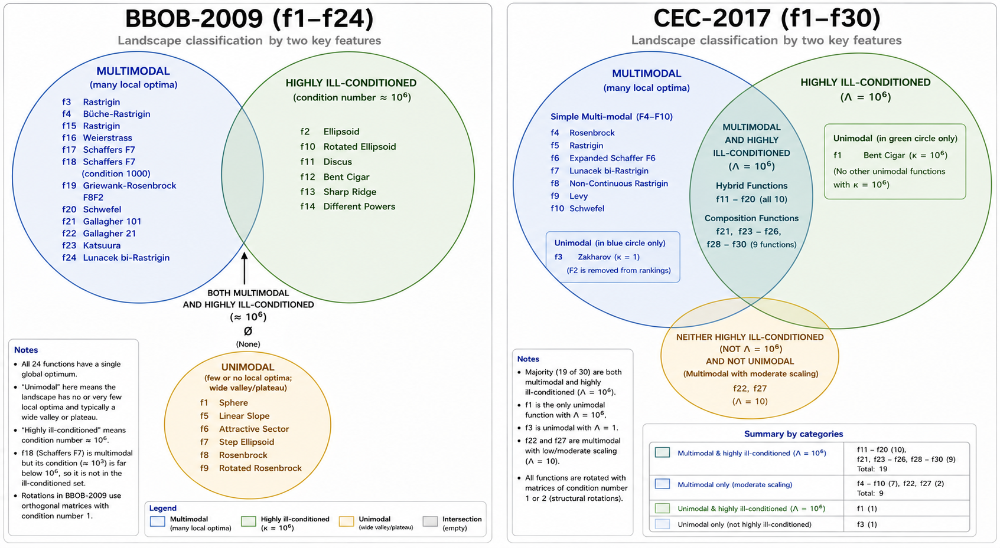

> Three wise men from freezing North<br>
> Keep telling me and holding forth<br>
> The metal will not bring a yield<br>
> The game's not worth the candle, nor the labor's field<br> 
> <br>
> But I am planting my aluminium cucumbers, ah-ah<br>
> Right on a tarpaulin field<br>
> Yes I am planting my aluminium cucumbers, ah-ah<br>
> Right on a tarpaulin field<br> 
> <br> 
> [\- AI-MUSIC KANYE WEST ft. ВИКТОР ЦОЙ - ALUMINIUM CUCUMBERS](https://www.youtube.com/watch?v=980EpMVJ6Pg&list=RD980EpMVJ6Pg&start_radio=1)

<br>

<br>

<p align="center">
  
</p>

## Do We Need Complex Modern Optimization Algorithms?

The "CMA" part in "CMAES" solves badly scaled non-separable cost functions (ill-conditioning = stiffness), see e.g. [Issue 356](https://github.com/CMA-ES/pycma/issues/356). However, if one's variables are proper, the ES part is literally this code:

```python
import numpy as np

class CWALK:
    def __init__(self, D, x0=None, sigma=1.0, lam=None, rng=None):
        self.D = D
        self.rng = np.random.default_rng() if rng is None else rng

        if x0 is None:
            raise ValueError("x0 must be provided by the driver script.")

        self.xmean = np.asarray(x0, dtype=float).copy()
        self.sigma = float(sigma)

        self.lam = 100 * D if lam is None else int(lam)
        self.mu = self.lam // 2

        self.best_x = self.xmean.copy()
        self.best_f = np.inf

    # ------------------------------------------------------------
    # ASK
    # ------------------------------------------------------------
    def ask(self):
        self.Z = self.rng.standard_normal((self.lam, self.D))
        X = self.xmean + self.sigma * self.Z
        return X

    # ------------------------------------------------------------
    # TELL
    # ------------------------------------------------------------
    def tell(self, X, fitness, sigma):
        X = np.asarray(X, dtype=float)
        fitness = np.asarray(fitness, dtype=float)
        order = np.argsort(fitness)

        # best-so-far
        if fitness[order[0]] < self.best_f:
            self.best_f = float(fitness[order[0]])
            self.best_x = X[order[0]].copy()

        # update mean
        self.xmean = np.mean(X[order[:self.mu]], axis=0)
        self.normz = np.linalg.norm(np.mean(self.Z[order[:self.mu]], axis=0))

        # update sigma
        if sigma is not None:
            self.sigma = sigma
```

Believe it or not, the code solves the rotated Lunacek bi-Rastrigin (F24 BBOB-2009). This is where all the intricate Newton/Powell methods fail, including the MCS and Nomad.

## Setup

```
git clone https://github.com/aabbtree77/cwalk.git
cd cwalk

uv venv

source .venv/bin/activate

uv pip install \
    numpy \
    scipy \
    matplotlib \
    cma \
    coco-experiment \
    ipython \
    minionpy
```

## The Good: F24 BBOB-2009

```bash
python3 test_bbob2009.py

Problem
----------------------------------------
Backend : BBOB
Name    : bbob_f024_i01_d40
D       : 40
Bounds  : [-5.0, 5.0] for every coordinate
fopt    : 102.61
Created : 2026-07-27 00:29:20

Initial sigma : 1
evals=    100000 best_f=5.299968e+02 error=4.273868e+02 sigma=8.017e-01
evals=    200000 best_f=4.000308e+02 error=2.974208e+02 sigma=6.368e-01
evals=    300000 best_f=3.666502e+02 error=2.640402e+02 sigma=5.058e-01
evals=    400000 best_f=3.473649e+02 error=2.447549e+02 sigma=4.018e-01
evals=    500000 best_f=3.265643e+02 error=2.239543e+02 sigma=3.192e-01
evals=    600000 best_f=3.240048e+02 error=2.213948e+02 sigma=2.535e-01
evals=    700000 best_f=3.240048e+02 error=2.213948e+02 sigma=2.014e-01
evals=    800000 best_f=3.240048e+02 error=2.213948e+02 sigma=1.600e-01
evals=    900000 best_f=3.240048e+02 error=2.213948e+02 sigma=1.271e-01
evals=   1000000 best_f=3.240048e+02 error=2.213948e+02 sigma=1.009e-01
evals=   1100000 best_f=3.240048e+02 error=2.213948e+02 sigma=8.017e-02
evals=   1200000 best_f=3.240048e+02 error=2.213948e+02 sigma=6.368e-02
evals=   1300000 best_f=3.121135e+02 error=2.095035e+02 sigma=5.058e-02
evals=   1400000 best_f=3.013288e+02 error=1.987188e+02 sigma=4.018e-02
evals=   1500000 best_f=2.701156e+02 error=1.675056e+02 sigma=3.192e-02
evals=   1600000 best_f=2.091583e+02 error=1.065483e+02 sigma=2.535e-02
evals=   1700000 best_f=1.721276e+02 error=6.951763e+01 sigma=2.014e-02
evals=   1800000 best_f=1.526473e+02 error=5.003727e+01 sigma=1.600e-02
evals=   1900000 best_f=1.316534e+02 error=2.904339e+01 sigma=1.271e-02
evals=   2000000 best_f=1.206309e+02 error=1.802090e+01 sigma=1.009e-02
evals=   2100000 best_f=1.119537e+02 error=9.343675e+00 sigma=8.017e-03
evals=   2200000 best_f=1.104614e+02 error=7.851370e+00 sigma=6.368e-03
evals=   2300000 best_f=1.074570e+02 error=4.847032e+00 sigma=5.058e-03
evals=   2400000 best_f=1.054741e+02 error=2.864093e+00 sigma=4.018e-03
evals=   2500000 best_f=1.047269e+02 error=2.116855e+00 sigma=3.192e-03
evals=   2600000 best_f=1.039641e+02 error=1.354105e+00 sigma=2.535e-03
evals=   2700000 best_f=1.035237e+02 error=9.137222e-01 sigma=2.014e-03
evals=   2800000 best_f=1.032888e+02 error=6.788106e-01 sigma=1.600e-03
evals=   2900000 best_f=1.031278e+02 error=5.178318e-01 sigma=1.271e-03
evals=   3000000 best_f=1.029578e+02 error=3.478413e-01 sigma=1.009e-03
evals=   3100000 best_f=1.028953e+02 error=2.853422e-01 sigma=8.017e-04
evals=   3200000 best_f=1.028682e+02 error=2.582219e-01 sigma=6.368e-04
evals=   3300000 best_f=1.028322e+02 error=2.222083e-01 sigma=5.058e-04
evals=   3400000 best_f=1.028317e+02 error=2.216639e-01 sigma=4.018e-04
evals=   3500000 best_f=1.028190e+02 error=2.090154e-01 sigma=3.192e-04
evals=   3600000 best_f=1.028112e+02 error=2.012098e-01 sigma=2.535e-04
evals=   3700000 best_f=1.028073e+02 error=1.973345e-01 sigma=2.014e-04
evals=   3800000 best_f=1.028049e+02 error=1.948547e-01 sigma=1.600e-04
evals=   3900000 best_f=1.028034e+02 error=1.934189e-01 sigma=1.271e-04
evals=   4000000 best_f=1.028017e+02 error=1.917442e-01 sigma=1.009e-04

Finished
----------------------------------------
Completed evaluations : 4000000
Requested budget      : 4000000
Best f                : 1.028017441860e+02
fopt                  : 1.026100000000e+02
Error                 : 1.917441860190e-01
Progress saved to     : progress_bbob2009_f24.csv

```

It takes 1e4xD evals to reach 0.2% relative error.

- Reduce budget 10x, reduce lambda 10x, relative error will increase 10x.
- Increase budget 10x, increase lambda 10x, relative error will decrease 100x!

For 1e7xD evals the relative error is still O(1e-5).

lambda=D does not reach the global optimum at all. Anything interesting starts with lambda=10D.

Restart to avoid adversarial initial points. Restarting does not improve precision/convergence. However, it is essential: unlike in CMAES, a zero does not lead to the optimum.

Normality is not essential, but other distributions do not improve optmization.

One can reach relative error O(1e-5) with

```python
self.Z = self.rng.laplace(0.0, 1.0, (self.lam, self.D))
```

or even uniform distribution:

```python
self.Z = self.rng.uniform(-3.0, 3.0, (self.lam, self.D))
```

Uniformity within [-5.0, 5.0] will still work, but [-1.0, 1.0] won't. The scale in the Laplace distribution can go up to 3.0..4.0, but no further.

The choice of the final sigma value at the end of the budget, be it 1e-4 or 1e-6, is not too critical. The choice of the initial sigma value is. For very large budgets sigma can be tiny and constant, otherwise we go with 10% of the biggest coordinate range (from box constraints).

Adding random sigma bursts during the optimization does not improve anything.

Expect to solve a good half of the whole BBOB-2009 with the ES (if not everything except F2, F10 - F14, but these can be done with scipy BFGS).

## The Bad: F12 CEC-2022

```bash
python3 test_cec2022.py

Problem
----------------------------------------
Backend : CEC2022
Name    : CEC2022 f12
D       : 20
Bounds  : [-100.0, 100.0] for every coordinate
fopt    : 2700.0
Created : 2026-07-27 00:53:02

Initial sigma : 20
evals=    100000 best_f=3.078020e+03 error=3.780203e+02 sigma=1.274e+01
evals=    200000 best_f=2.995935e+03 error=2.959349e+02 sigma=8.036e+00
evals=    300000 best_f=2.986139e+03 error=2.861390e+02 sigma=5.070e+00
evals=    400000 best_f=2.986139e+03 error=2.861390e+02 sigma=3.199e+00
evals=    500000 best_f=2.986139e+03 error=2.861390e+02 sigma=2.019e+00
evals=    600000 best_f=2.985843e+03 error=2.858433e+02 sigma=1.274e+00
evals=    700000 best_f=2.985738e+03 error=2.857379e+02 sigma=8.036e-01
evals=    800000 best_f=2.985697e+03 error=2.856973e+02 sigma=5.070e-01
evals=    900000 best_f=2.985667e+03 error=2.856670e+02 sigma=3.199e-01
evals=   1000000 best_f=2.985649e+03 error=2.856490e+02 sigma=2.019e-01
evals=   1100000 best_f=2.985646e+03 error=2.856463e+02 sigma=1.274e-01
evals=   1200000 best_f=2.985643e+03 error=2.856425e+02 sigma=8.036e-02
evals=   1300000 best_f=2.985642e+03 error=2.856422e+02 sigma=5.070e-02
evals=   1400000 best_f=2.985642e+03 error=2.856419e+02 sigma=3.199e-02
evals=   1500000 best_f=2.985642e+03 error=2.856417e+02 sigma=2.019e-02
evals=   1600000 best_f=2.985642e+03 error=2.856417e+02 sigma=1.274e-02
evals=   1700000 best_f=2.985642e+03 error=2.856416e+02 sigma=8.036e-03
evals=   1800000 best_f=2.985642e+03 error=2.856416e+02 sigma=5.070e-03
evals=   1900000 best_f=2.985642e+03 error=2.856416e+02 sigma=3.199e-03
evals=   2000000 best_f=2.985642e+03 error=2.856416e+02 sigma=2.019e-03

Finished
----------------------------------------
Completed evaluations : 2000000
Requested budget      : 2000000
Best f                : 2.985641603543e+03
fopt                  : 2.700000000000e+03
Error                 : 2.856416035435e+02
Progress saved to     : progress_cec2022_f12.csv
```

I have not seen any algorithm to go below 2900.

## The Ugly: F10 BBOB-2009

"F10 is the Ellipsoidal Function (a high-conditioning, unimodal function). It is hard to optimize because it features an extreme condition number (around 1e6) combined with non-separability, meaning its axes are rotated and scale at vastly different rates."

"A very rough rule of thumb is that without CMA, the number of evaluations are proportional to the condition number..." - Nikolaus Hansen, [Issue 356.](https://github.com/CMA-ES/pycma/issues/356)

ES becomes brittle with ill-conditioning. The eval number can be proprotional to the condition number squared... The (mu, lambda)-ES reaches f = -29.5 (when fopt = -54.94) on F10 BBOB-2009 in 1B evals with a constant step size 1e-3. After 1M evals it is still at f = 2.61e+07...

After some more thorough testing, see [Minion Issue 11](https://github.com/khoirulmuzakka/Minion/issues/11), it is tempting to resort to ARRDE.

## Rules of the Game

So this is all about multimodality, ill-conditioning, dimensions, and evalutation budgets.

The figure above indicates that a large part of BBOB-2009, if not entirely the whole benchmark, can be covered by running any solid Newton (scipy SLSQP/BFGS) with the ES and choosing the better result.

CEC-2017 is a bigger challenge with functions which are both: multimodal and ill-contioned. Moreover, with a few exceptions, its F21-F30 functions are not solvable by any known method.

Practically, solvable means getting close to the global optimum within, say, 1% relative error in 1B evals. For CEC-2017 specifically, solvable means reaching the absolute error smaller than 100.0. F24 CEC-2017 is solved if one reaches 2400s, not 2500. F25 CEC-2017 is solved if one reaches 2500s, not 2600.

A preliminary view:

```markdown
|  Algorithm   | F10 BBOB-2009 D=40 | F24 BBOB-2009 D=40 | F24 CEC-2017 D=20 | F25 CEC-2017 D=20 |
| :----------: | -----------------: | -----------------: | ----------------: | ----------------: |
|      ES      |                >1B |      <10M f=102.61 |      >200M f=2800 |        >1B f=2900 |
| BIPOP-aCMAES |               <50K |      <10M f=102.61 |      =200M f=2500 |      =200M f=2899 |
|    ARRDE     |              <500K |     =200M f=1.4895 |      =200M f=2400 |        =1B f=2700 |
```

- ES: wipes the floor with Newton/Powell on Rastrigin-like multimodals. Outstanding only with mild condition numbers (up to ~1000, still solves F18 BBOB-2009). It is sensitive w.r.t. starting points, but this is nothing serious.

- BIPOP-aCMAES (pycma CMAES), used to be the best, fails on F21 - F30 CEC-2017 when there is no single coordinate system to rescale-unrotate. Face-plants on F25 CEC-2017 already in D=10. Often gets stuck with a premature convergence due to an exponentially decreasing step size, lacks mechanisms to escape and continue, relies on dumb restarts with increasing population size. The search is ES in an adapted coordinate system, which is much worse than any modern DE which uses only population vector differences, decreasing population sizes, more self-observation and adaptation with archives, more sophisticated off-spring generation/replacements than (mu, lambda). 

- ARRDE: completely solves F24 CEC-2017 (in D=20), yet cannot nail F25 CEC-2017 in D=20 (solves it in D=10). Notably, ARRDE sustains ill-conditioning without matrices, and does it much better than BIPOP-aCMAES. ARRDE is the best DE in my experience.

Scroll down for more benchmarking on CEC-2017.

## Anything Better Out There?

- DEs lose their quality w.r.t. increasing D beyond 10, try F24 BBOB-2009 in D=40 which is solvable by ES.

- ES/CMAES are much worse at ill-conditioning than DEs, try F24 CEC-2017 in D=20, or F25 CEC-2017 in D=10, both solvable by ARRDE/R6 (see below).

- Nothing solves F25 CEC-2017 in D=20.

### CMAES Mods?

- Lots of CMAES complications exist, but I could not get anything from them, e.g.

  Dimitar Nedanovski et al. (2026) [MSC-CMA-ES: Structure-Aware Restarts for CMA-ES via Cyclic Nearest-Better Basin Discovery](https://arxiv.org/abs/2606.15830), [Github](https://github.com/snenovgmailcom/cma_es_project/tree/main)

  It does not reach f = 2400 on F24 CEC-2017 at all and does not look any different than BIPOP-aCMAES, despite the paper hinting that it could be interesting on the CEC-2017 composites. Very slow even with the C++ acceleration.

  Default parameters, seed = 20260825, F24 CEC-2017 D=20 got precisely f = 2500 in 200M evals, which took about 5 hours to run (a single optimization) on i7 gen4 16GB RAM. The C++ acceleration is only for clustering, pycma CMAES runs inside MSC-CMA-ES.

- Another one bites the dust:

  Khoirul Faiq Muzakka et al. (2026) [RCMAES: A Robust CMA-ES Variant for CEC2026 Competition](https://arxiv.org/abs/2604.27138)

  No difference, except that it is much faster to test than pycma and MSC-CMA-ES and is integrated into [Minion](https://github.com/khoirulmuzakka/Minion), though we did have libcmaes before.

- Simplifications exist, but what to do with them?

  Zhenhua Li and Qingfu Zhang (2017) [A Simple Yet Efficient Rank One Update for Covariance
  Matrix Adaptation](https://arxiv.org/abs/1710.03996)

  See pycma's [Issue 356](https://github.com/CMA-ES/pycma/issues/356) for some of it in action, also consider adjusting the CSA according to pycma [Issue 231](https://github.com/CMA-ES/pycma/issues/231).

Some more papers related to CMAES and matrices:

- M.J. Box (1966) A Comparison of Several Current Optimization Methods, and the use of Transformations in Constrained Problems

- J. Bernussou and J. Geromel (1981) An easy way to find gradient matrix of composite matricial functions

- [CMAES 1996 - 2014](https://cma-es.github.io/)

- Aurore Blelly et al. (2018) [Stopping Criteria, Initialization, and Implementations of
  BFGS and their Effect on the BBOB Test Suite](https://inria.hal.science/hal-01811588/file/workshop_paper-authorversion.pdf)

- Nikolaus Hansen (2019) [A Global Surrogate Assisted CMA-ES](https://inria.hal.science/hal-02143961v1/document), [pycma (github)](https://github.com/CMA-ES/pycma), [pycma Issue 356](https://github.com/CMA-ES/pycma/issues/356)

- Nikolaus Hansen at al. (2019) [Real-Parameter Black-Box Optimization Benchmarking 2009: Noiseless Functions Definitions](https://inria.hal.science/inria-00362633v2/document)

- Zachary Hoffman and Steve Huntsman (2022) [Benchmarking an algorithm for expensive high-dimensional
  objectives on the BBOB and BBOB-largescale testbeds](https://hal.science/hal-03665291v1/file/GECCOarXiv2022.pdf)

- Eryk Warchulski and Jarosław Arabas (2024) [Alternative Step-Size Adaptation Rule for the Matrix Adaptation
  Evolution Strategy](https://pdfs.semanticscholar.org/c156/492ae2d25a148c19a3043836693d0ebaeea4.pdf)

See also [356](https://github.com/CMA-ES/pycma/issues/356), [367](https://github.com/CMA-ES/pycma/discussions/367).

### Dual Annealing?

scipy includes an algorithm called "dual annealing" (DA) which runs BFGS as local search. Scroll down [this code](https://github.com/sgubianpm/sdaopt/blob/master/sdaopt/_sda.py) for all the references. DA got visible first in the R community.

I did not get anything from DAs on CEC2017 F21 - F30 in D=20. Also tried [this code](https://github.com/DawitLam/Improvements_to_Dual_Annealing_in_SciPy) to no avail.

Minion includes [one interesting comparison](https://minion-py.readthedocs.io/en/stable/l_bfgs_b_notebook.html) between the ARRDE, numerous BFGS implementations, and two DA implementations. It turns out that Minion's DA is worse than scipy DA, except on F17 and F26 (CEC-2017). ARRDE is clearly better than anything on: F10, F12, F17 (somewhat), F21, F22, F24, F26, F28, and F30. However, in the rest of the cases DAs are close and on F25 scipy DA = 2600 (!), ARRDE and the rest are close and only around 2900. It is the first time I see the problem where the ARRDE could be clearly worse. WTF?!

D=10 does not generalize to D=20 at all. According to [Minion's notebook](https://minion-py.readthedocs.io/en/stable/l_bfgs_b_notebook.html), ARRDE solves F26 CEC-2017 in D=10 in fewer than 100K evals (reaching 2600). In my runs, for the zero starting point, seed = 20260815, ARRDE reaches only 2800 in 2B evals (F26 CEC-2017 D=20). Night and day.

### Testing ARRDE

F25 CEC-2017 D=20, 1B evals: ARRDE f=2700, seed=20260829, single run takes 4.68 hours on i7 gen 4 16GB RAM.

F28 CEC-2017 D=20, <=200M evals: ARRDE f=3000, BIPOP-aCMAES f=3100; fopt = 2800.

F24 CEC-2017:

- restarts are critical, at least O(10) are needed,

- 200M evals are sufficient to solve the problem completely (f=fopt=2400) when the seed is good.

F25 CEC-2017:

- restarts may not be needed,

- 1B evals still do not solve the problem (f=2700, fopt=2500).

Making significant progress on F24 does not imply its transfer on F25 and vice versa.

ARRDE can be inconsistent w.r.t. increasing budgets, e.g. F25 CEC-2017 D=20 seed=20260829:

- 500M evals: f=2800,
- 1B evals: f=2700,
- 2B evals: f=2800.

Also, when setting a budget say to 200M, the first 10M evals can lead to a better result than rerunning
the whole thing with 10M evals or 20M evals, and this is not so predictable due to population size reduction and global phases.

On F24 CEC-2017, ARRDE can be very picky with seeding or whether zero is included in the initial population, unless it is used in the special restart mode, read below.

ARRDE adds (to the jSO algorithm) global phases with some intricate refinement machinery via merged local intervals acting as an implementation of [Tabu Search](https://github.com/zarankumar/tabu-search).

Decent up to D=10, afterwards every problem becomes a special case. Might work spectacularly (F24 CEC-2017 D=20), but may also lead to nowhere (F25 CEC-2017 D=20). Generally very bad with increasing D>10 as the experiments with F24 BBOB-2009 for D=10, 20,40, 100 would show.

Minion's ARRDE C++ code execution slows down superlinearly w.r.t. increasing number of evals, becomes ~2x slower beyond 500M evals.

## CEC-2017 Composites

CEC-2017 was a step forward compared to CEC-2014 and BBOB-2009. It added multiple ill-conditioned matrices and revealed the simplest problems not amenable to any modern technology to date (2026). They rule out any existing ES and DE.

The composites F21-F30 are the hardest cost functions of the benchmark. Do not run anything on F25 in D=20, better wait for the next generation PCs or utilize server resources if there is such a possibility. All the algorithms of [Minion](https://github.com/khoirulmuzakka/Minion) fail on the composites in D>10, with some rare exceptions.

What are these challenges?

Firstly, the subsets of already deceptive functions (in each given list) are mixed into hybrids.

In turn, these hybrids are rotated and scaled with different matrices and further mixed with some distance based weights.

Any single function is often already deceptive: multimodal, sometimes non-differentiable. It can already be ill-conditioned before being mixed into a hybrid. The latter in turn will get their own ill-conditioning. The key is ill-conditioning with multiple matrices in higher D>10. This is what kills modern ESes and DEs.

There are separate research works with a deep focus on some components, see e.g. [Happy Cat Function](https://www.researchgate.net/publication/234024034_HappyCat_-_A_Simple_Function_Class_Where_Well-Known_Direct_Search_Algorithms_Do_Fail) which is a deceptive ridge generator designed to obfuscate ES and DE searches.

Deceptiveness is less severe than multiple ill-condtioned matrices and increasing D>10.

Initial functions/components extracted from multilayer mixing (which is still only 2 layers, more or less, in CEC-2017):

F30:

1. Rastrigin's Function
2. Griewank's Function
3. Schaffer’s F6 Function
4. Rosenbrock's Function
5. Katsuura Function
6. Ackley's Function
7. Expanded Griewank's plus Rosenbrock's Function
8. Modified Schwefel's Function

F29:

1. Rastrigin's Function
2. Griewank's Function
3. Schaffer’s F6 Function
4. Rosenbrock's Function
5. High Conditioned Elliptic Function
6. Ackley's Function
7. HGBat Function
8. Discus Function
9. Bent Cigar Function
10. Expanded Griewank's plus Rosenbrock's Function
11. Weierstrass Function

F28:

1. Rastrigin's Function
2. Griewank's Function
3. Rosenbrock's Function
4. Schaffer’s F6 Function
5. Katsuura Function
6. Ackley's Function

F27:

1. HGBat Function
2. Rastrigin's Function
3. Modified Schwefel's Function
4. Bent-Cigar Function
5. High Conditioned Elliptic Function
6. Expanded Schaffer's F6 Function

F26:

1. Expanded Schaffer's F6 Function
2. Modified Schwefel's Function
3. Griewank's Function
4. Rosenbrock's Function
5. Rastrigin's Function

F25:

1. Rastrigin's Function
2. Happy Cat Function
3. Ackley's Function
4. Discus Function
5. Rosenbrock's Function

F24:

1. Ackley's Function
2. High Conditioned Elliptic Function
3. Griewank's Function
4. Rastrigin's Function

F23:

1. Rosenbrock's Function
2. Ackley's Function
3. Modified Schwefel's Function
4. Rastrigin's Function

F22:

1. Rastrigin's Function
2. Griewank's Function
3. Modified Schwefel's Function

F21:

1. Rosenbrock's Function
2. High Conditioned Elliptic Function
3. Rastrigin's Function

### Results with Selected CEC-2017 Composites

D=20, seed=20260829, 200M evals.

| Place |  Algorithm   |  F22 |  F24 |  F25 |  F28 |
| :---: | :----------: | ---: | ---: | ---: | ---: |
|   1   |      R6      | 2251 | 2438 | 2600 | 2804 |
|   2   |    ARRDE     | 2243 | 2400 | 2899 | 3000 |
|   3   |   SLSQP\*    | 2300 | 2500 | 2600 | 3100 |
|   4   | BIPOP-aCMAES | 2300 | 2800 | 2910 | 3100 |

- R6 (my own ARRDE mod): solves F22, F24, F28, also F25 in D=10 (but not in D=20).

- ARRDE: solves F22 and F24, also F25 in D=10 (but not in D=20).

- SLSQP*: my own improvement over scipy SLSQP. Local minima are collected into the list of "poles" (300),
  each of radius 3.0 during the optimization. When SLSQP gets stuck, it restarts anew with the previous local minimum added as a pole/constraint to avoid that minimum. Sort of tunneling/filling. A new starting point is the maximization endpoint reflected away from the nearest pole, to avoid dealing with extra parameters. Maximization follows minimization in an alternating manner to escape local minima. It is likely not to be essential, I believe j2020 or jDE100 used this and dropped it, nobody knows where to move after getting stuck frankly. SLSQP* is surprisingly decent on F22, F24, and F25, but it does not solve any of them. Also it is very bad on F24 BBOB-2009.

- BIPOP-aCMAES: inferior to SLSQP\* on the composites, but vastly better than any of these algorithms on F24 BBOB-2009.

Not much can be said about F21, F23, F26, F27, F29, and F30. Likely unsolvable already in D=20.

**A month later:**

Vanilla ARRDE also solves F28, but one needs to use tiny popsize=50, and run restarts with 20M eval budget. This mode also solves F24 much faster, 10M eval budget is enough with about 5 restarts. It also gets into 2600.

However, restarts with tiny budgets are detrimental on F25 in D=10:

|               Algorithm                |    f |
| :------------------------------------: | ---: |
|                   R6                   | 2500 |
|      ARRDE: 200M seed = 20260929       | 2500 |
|       ARRDE: 50x20M seeds 0..49        | 2600 |
| ARRDE: popsize = 50 50x20M seeds 0..49 | 2600 |

I put R6 on hold for now. It can be 10x faster than ARRDE in evals on F25 in D=10, also ~5x faster in real time for >1B evals, but this is not important. It is better to select a simpler algorithm than ARRDE as a base for improvements, like j2020. ARRDE is rather complex and overtuned/maxed-out.

## Vicinity of the Global Minimum

F25 CEC-2017 in D=20 is a needle in a haystack.

The box is [-100, 100]^20.

Around the global minimum, the sphere of radius 2.6 already produces points above f=2600,
but these are the best f-values of a wider deceptive region/attractor.

It is still hard to get even into that f=2600 attractor. ARRDE requires tinkering.

```bash
==============================================================================
CEC2017 F25 / D=20
==============================================================================
Benchmark f_opt : 2.500000000000000e+03
Evaluated f(CENTER): 2.500000000000000e+03
Difference from benchmark optimum: 0.000000000000000e+00

Global optimum coordinates:
x[ 1] =  9.5857011347942525e+00
x[ 2] =  7.3284069743605357e+01
x[ 3] = -2.0094577798663906e+01
x[ 4] =  1.7371653140229942e+01
x[ 5] =  5.9574127940262727e+01
x[ 6] = -7.3501078371657567e+00
x[ 7] = -7.2252707276610991e+01
x[ 8] =  7.1523160505817813e+01
x[ 9] = -3.0593826926589863e+01
x[10] =  2.9168098455838908e+01
x[11] = -4.8827527560679016e+00
x[12] = -2.0297992276166561e+01
x[13] = -2.9676773673704254e+01
x[14] =  6.9616639408104419e+01
x[15] = -2.0525248447677704e+01
x[16] =  6.3380734488079668e+01
x[17] =  5.0897438177325498e+01
x[18] = -2.7404310164695751e+01
x[19] =  4.2375220020476362e+01
x[20] = -6.8372003363618632e+01

Sphere radius requested : 2.600000000000
Number of sphere points : 20
Random seed             : 20260926

idx   distance from CENTER          f(x)
---   ----------------------   ----------------------
  1        2.599999999999998    2.629636086737374e+03
  2        2.600000000000004    2.625406875661240e+03
  3        2.599999999999998    2.622794897119958e+03
  4        2.600000000000001    2.619765718635950e+03
  5        2.599999999999998    2.630442065951148e+03
  6        2.599999999999994    2.633805380061843e+03
  7        2.600000000000004    2.609663671141000e+03
  8        2.599999999999995    2.623780417555373e+03
  9        2.599999999999998    2.631237490944540e+03
 10        2.599999999999995    2.610352600002223e+03
 11        2.600000000000003    2.615985974975741e+03
 12        2.600000000000000    2.614363551126151e+03
 13        2.600000000000002    2.637206051053545e+03
 14        2.600000000000001    2.604314325506584e+03
 15        2.600000000000001    2.618162146817209e+03
 16        2.600000000000000    2.620541351031640e+03
 17        2.600000000000000    2.632102145035525e+03
 18        2.600000000000005    2.619249925266242e+03
 19        2.600000000000000    2.622497903425905e+03
 20        2.600000000000000    2.632773260194739e+03

Sphere min  f = 2.604314325506584e+03
Sphere max  f = 2.637206051053545e+03
Sphere mean f = 2.622704091912197e+03
```

Even at 2.5 it is still 1/20 chance to see the direction below 2600, any mu-averaging would lose it:

```bash
Sphere radius requested : 2.500000000000
Number of sphere points : 20
Random seed             : 20260926

idx   distance from CENTER          f(x)
---   ----------------------   ----------------------
  1        2.500000000000000    2.622540334827559e+03
  2        2.499999999999998    2.618613571225004e+03
  3        2.500000000000000    2.616154304786483e+03
  4        2.500000000000000    2.613354887936021e+03
  5        2.500000000000000    2.623250035207675e+03
  6        2.499999999999998    2.626366569770741e+03
  7        2.500000000000002    2.604007963855981e+03
  8        2.500000000000002    2.617063556581270e+03
  9        2.499999999999996    2.623973395079520e+03
 10        2.500000000000002    2.604645806623607e+03
 11        2.500000000000000    2.609856338658577e+03
 12        2.500000000000003    2.608341155895762e+03
 13        2.499999999999999    2.629555808086666e+03
 14        2.500000000000001    2.599056596278414e+03
 15        2.499999999999998    2.611868607211285e+03
 16        2.500000000000004    2.614081095829475e+03
 17        2.499999999999998    2.624817280430716e+03
 18        2.499999999999997    2.612874689563205e+03
 19        2.500000000000000    2.615887632205078e+03
 20        2.499999999999999    2.625497713046359e+03

Sphere min  f = 2.599056596278414e+03
Sphere max  f = 2.629555808086666e+03
Sphere mean f = 2.616090367154970e+03
```

A sphere of radius 2.5 in D=20 has a volume 2.3471e6. The whole search space is 200^200 ~ 1.048576e+46. The volume ratio is ~1e+40.

This would be the amount of samples needed to hit the right region once, under the assumption of "f-uniformity".

In D=10, the radius is roughly the same. A sphere now has a volume 2.43202594745e4. The whole box is 200^100 ~ 1.024e23. The volume ratio is ~1e18. Already searchable with budgets of O(1e8..1e9) evals, believe it or not.

**F25 CEC-2017 Global Minimum Vicinity Volume**

|           D            |          2 |         10 |         20 |         30 |          50 |         100 |
| :--------------------: | ---------: | ---------: | ---------: | ---------: | ----------: | ----------: |
|         Radius         |        2.3 |        2.5 |        2.5 |        1.6 |       0.925 |      0.3782 |
|         Volume         | 1.6619e+01 | 2.4320e+04 | 2.3471e+06 | 2.9131e+01 |  3.5090e-15 |  1.4014e-82 |
| 200<sup>D</sup>/Volume | 2.4069e+03 | 4.2105e+18 | 4.4675e+39 | 3.6860e+67 | 3.2086e+129 | 9.0454e+311 |

When someone says that "It works in D=10, so it will work in D=20, 40... I just don't want to waste time on longer runs", one should better appreciate these numbers.

On the other hand, these numbers are too pessimistic. A narrow gap can also be a funnel. We do not know the scope/attractiveness of the global minimum vicinity from these numbers.

F24 CEC-2017 in D=20 is solvable by ARRDE. The global minimum vicinity radius is 9.3 in D=20. A volume of the sphere is ~6.044977e+17, and the discussed ratio is 1.734624e+28. This is enormous, but solvable.

For the curious, in D=30, the F24 global minimum vicinity radius is 10.0. Spherical volume is 2.1915e+25, and the ratio is 4.8995e+43 vs 3.6860e+67 in F25. In D=100, the F24 radius is 8.4. Its spherical volume is 6.3438e+52, and the ratio is 1.9983e+177 vs 9.0454e+311 in F25.

When D=20, running ARRDE with 1M evals independently, including one of the 20 spherical points of the global vicinity (of a fixed radius) in the initial population each time, reveals that F24 is quite a funnel. The global minimum is still reachable from a sphere of radius 80.0 (a pessimistic estimate was 9.3). For F25, the radius increases only to 8.0 (pessimistic estimate 2.5).

|         Problem         |        F24 |        F25 |
| :---------------------: | ---------: | ---------: |
|         Radius          |       80.0 |        8.0 |
|         Volume          | 2.9753e+36 | 2.9753e+16 |
| 200<sup>20</sup>/Volume |  3.5242e+9 | 3.5242e+25 |

F24 CEC-2017 in D=20 indicates that when the problem is solvable (by ARRDE), the worst case sampling complexity O(1e+28) shrinks to O(1e+9) which matches the budgets available to solve it.

For F25 in D=20, ARRDE shrinks complexity from O(1e+39) down to O(1e+25), which is not enough to solve the problem. This somewhat indicates that simply increasing budgets and heavily restarting ARRDE with tweaks won't solve the problem as we are still 25-9=16 orders behind in sampling complexity.

For F25 in D=10, the pessimistic radius is 2.5, while the one from ARRDE runs is 8.1. The sampling complexity shrinks from O(1e+18) to O(1e+13). This is still 4 orders away from O(1e+9), but already much closer than O(1e+25). One should keep in mind that the estimates here are very crude and they underestimate vicinity radius. I use only 20 runs with 1M evals to save electricity, but the latter number should be at least 50M.

In any case, this should suffice to get a rough picture of how problems F24 and F25 differ in dimensions 10 and 20, why F24 is solvable in D=20 and why F25 is already shaky in D=10 (shaky = none of the CEC-2020 contestants solved it).

## Some Further Research on CEC-2017 Composites

- To my knowledge, the CEC-2020 algorithms were the first to solve some of the CEC-2017 composite functions: IMODE, AGSK, j2020... The top 4 in CEC-2017 were not there (e.g. jSO is vastly inferior to j2020). I am not sure about CEC-2018, while CEC-2019 was a different problem set. Despite IMODE's minor use of SQP to fine tune, no matrices are needed to deal with severe ill-conditioning, think about it!

- j2020 solved F22 CEC-2017 D=10,15,20 and F24 CEC-2017 D=10. Minion's implementation is ~3x slower to execute than the original. j2020 adds to jDE-2006 two ideas: (i) an additional small population which acts like a local optimizer, and (ii) crowding which replaces similar offspring with offspring rather than with the parent (copes better with population collapse). These two techniques lead to a much better algorithm than jSO-2017. 

- j2020's pseudocode is the prettiest I have seen. It uses the right level of granularity. 

- Sadly, j2020 performs worse than ARRDE, and I did not experience a miracle with j2020 at 2B evals (nor with jDE100 which did occur for the authors in CEC-2019).

- AGSK solved F24 CEC-2017 D=15 as well, IMODE also solved F24 CEC-2017 D=20. NL-SHADE-RSP later did too. EBOwithCMAR, HSES, LSHADE-cnEpSin, and LSHADE-SPACMA did not. These are LSHADE derivatives, more or less.

- ARRDE is a derivative too, but it also solves F25 CEC-2017 D=10 (e.g. seed=20260929, 200M evals).

- ARRDE with popsize=50 and restartsx20M also solves F28 CEC-2017 D=20.

There is no separate CEC-2018 benchmark. CEC-2017 was carried over (for single objective bound constrained competition). 

Also:

- F22 CEC-2017 = F8 CEC-2020 = F8 CEC-2021 (shift+bias+rotation)
- F24 CEC-2017 = F9 CEC-2020 = F9 CEC-2021 (shift+bias+rotation)
- F25 CEC-2017 = F10 CEC-2020 = F10 CEC-2021 (shift+bias+rotation)

CEC-2022 tried to be "unique", but CEC-2017 has returned (carried over) to CEC-2023..CEC-2026 competitions in the bound constrained single function track.

References:

- Janez Brest et al. (2020) [Differential Evolution Algorithm for Single Objective Bound-Constrained Optimization: Algorithm j2020](https://vigir.missouri.edu/~gdesouza/Research/Conference_CDs/IEEE_WCCI_2020/CEC/Papers/E-24518.pdf)

- Janez Brest et al. (2021) [Self-adaptive Differential Evolution Algorithm with Population Size Reduction for Single Objective
  Bound-Constrained Optimization: Algorithm j21](https://labraj.feri.um.si/wp-content/uploads/janez/CEC2021-j21.pdf)

- Ali Wagdy et al. (2020) [Evaluating the Performance of Adaptive Gaining-Sharing Knowledge Based Algorithm on CEC 2020 Benchmark Problems](https://www.researchgate.net/publication/343837951_Evaluating_the_Performance_of_Adaptive_Gaining-_Sharing_Knowledge_Based_Algorithm_on_CEC_2020_Benchmark_Problems)

- Karam M. Sallam at al. (2020) [Improved Multi-operator Differential Evolution Algorithm for Solving Unconstrained Problems](https://vigir.missouri.edu/~gdesouza/Research/Conference_CDs/IEEE_WCCI_2020/CEC/Papers/E-24365.pdf)

- Vladimir Stanovov et al. (2021) [NL-SHADE-RSP Algorithm with Adaptive Archive and Selective Pressure for CEC 2021 Numerical Optimization](https://www.researchgate.net/publication/353782316_NL-SHADE-RSP_Algorithm_with_Adaptive_Archive_and_Selective_Pressure_for_CEC_2021_Numerical_Optimization)

- Tomofumi Kitamura and Alex Fukunaga (2025) [Is Selection All You Need in Differential Evolution?](https://arxiv.org/abs/2506.14425)

- Khoirul Faiq Muzakka, Ahsani Hafizhu Shali, Haris Suhendar, Sören Möller, Martin Finsterbusch (2026) [Robust Differential Evolution via Nonlinear Population Size Reduction and Adaptive Restart: The ARRDE Algorithm](https://arxiv.org/abs/2511.18429v4), [Minion (github)](https://github.com/khoirulmuzakka/Minion), [Minion Issue 11](https://github.com/khoirulmuzakka/Minion/issues/11), [algolist](https://minion-py.readthedocs.io/en/latest/algolist.html)

## Further Notes

- Tunneling and filling functions (see Aimo Törn and Antanas Žilinskas (1987) Global Optimization) in theory provide natural mechanisms to escape entrapment, but **the auxiliary problem is not simpler than the original.** The same holds for Bayesian Optimization. You had one problem to solve, now you have two or three (hyperparameters). One can do a lot of experiments here, but little interesting ever comes from these big generic frameworks.

- Modern DEs are pale on [Lunacek's bi-Rastrigin](https://coco-platform.org/testsuites/bbob/functions/f24.html) already in D=20, while (mu, lambda)-ES and BIPOP-aCMAES solve the problem in D=40 very rapidly in <10M evals. This cost function mixes quadrics with harmonics via sum and min operators and is used a lot in physics. Normally not a black box though, we have a gradient. Nonetheless, this shows that DEs can be very suboptimal on well-conditioned problems in D>10.

- Strive not to mix variables of different nature and scale. This complicates DFO enormously and nothing really works beyond D=10. CEC-2017 is only a two-layer mixing and generally non-solvable already in D=20. Nobody knows what to do about unsolvable cases like F25 CEC-2017 D=20. We can complicate this much further and no algorithm will ever catch up.

## A Few Months Later

Modern DEs are impressive in D=10, e.g. ARRDE solves the F25 CEC-2017 which, in some sense, is even harder than the F24 CEC-2017 D=20. However, in D=10 a cube has only 1024 vertices, so if we can restart a decent local algorithm 1000x, it already explores a lot of the search domain. But we can restart scipy SLSQP meaningfully a million times already on a local PC!

```bash
python restart_slsqp_cec2017.py --function 25 --dim 10 --algo slsqp
CEC2017 F25  D=10  algo=slsqp  budget=1000000000  maxiter=300
fopt ≈ 2.500000e+03

evals=    10000000  best_f=2.600005658860e+03  ||xbest||=1.491452e+02  time=     470.6s
evals=    20000000  best_f=2.600005658860e+03  ||xbest||=1.491452e+02  time=     924.2s
evals=    30000000  best_f=2.600005658860e+03  ||xbest||=1.491452e+02  time=    1398.9s
evals=    40000000  best_f=2.600005658860e+03  ||xbest||=1.491452e+02  time=    1846.8s
evals=    50000000  best_f=2.600005658860e+03  ||xbest||=1.491452e+02  time=    2292.1s
evals=    60000000  best_f=2.600005658860e+03  ||xbest||=1.491452e+02  time=    2800.4s
evals=    70000000  best_f=2.600005557724e+03  ||xbest||=1.491450e+02  time=    3322.9s
evals=    80000000  best_f=2.600005557724e+03  ||xbest||=1.491450e+02  time=    3847.3s
evals=    90000000  best_f=2.600005557724e+03  ||xbest||=1.491450e+02  time=    4309.1s
evals=   100000000  best_f=2.600005557724e+03  ||xbest||=1.491450e+02  time=    4771.0s
evals=   110000000  best_f=2.500000024338e+03  ||xbest||=1.479658e+02  time=    5220.6s
```

Bingo. A needle in a haystack is a solved problem in D=10.

In D=20, this massively restarted SLSQP with box constraints may no longer reach global optima under 1B evals. It hits those "next in line" suboptimal points in just 10..30M evals: f=2500 on F24, f=2900 on F28. f=2600 on F25 demands 150M evals. This is vastly better than BIPOP-aCMAES and sometimes even better than ARRDE.

## Why SLSQP and Not BFGS/L-BFGS-B

To restart a million times, one needs to run something smart for very few iterations, e.g. the SLSQP with 100..300 iterations. This algorithm was chosen by Niklaus Hansen in his 2019 report on the CMAES with surrogates as well.

SLSQP is a general algorithm which handles nonlinear constraints with the method of Lagrange. L-BFGS-B specializes to the box constraints only, which is exactly what we need here. A more special algorithm will be better. 

Wrong! BFGS turns out to run 10x slower than SLSQP in this special D=10 and small iteration numbers mode.

My prompt to Grok:

_scipy uses L-BFGS-B for box constraints which is C and very specialized, why is SLSQP 10x faster? Don't write me bullet lists, I know it all, I want a deeper answer, guru to guru._

Grok:

_You’re right — when bounds are supplied SciPy routes to L-BFGS-B, not the pure-Python BFGS. So the comparison that actually matters is L-BFGS-B versus SLSQP on a pure box-constrained problem at D ≈ 10 with a hard iteration ceiling.
At that scale the asymptotic advantages of limited-memory BFGS disappear. The working set is tiny, the dense 10 × 10 Hessian that SLSQP maintains costs almost nothing to factor, and the dominant costs become the quality of the search direction and the number of gradient evaluations required to make progress._

_L-BFGS-B builds its curvature information from a short history of (s, y) pairs and then solves a bound-constrained quadratic model by a Cauchy-point + primal subspace minimization. The Cauchy point itself is a projected gradient path that is cheap, but the subsequent minimization over the free variables is essentially a dense quasi-Newton step on a reduced space whose dimension fluctuates. Every time a bound becomes active or inactive the history is only partially reusable; the algorithm must re-project and often takes a very short step. With a fixed budget of a few hundred iterations those short or poorly scaled steps accumulate. The line-search (More–Thuente) is also conservative because the limited-memory Hessian can be a rather crude approximation early on, so many iterations end up doing only a fraction of the full Newton step.
SLSQP, by contrast, maintains a full dense BFGS approximation to the Hessian of the Lagrangian and, at every major iteration, solves the exact bound-constrained QP_

min ½ dᵀ B d + gᵀ d s.t. xl – x ≤ d ≤ xu – x

_with the classical Lawson–Hanson NNLS active-set method. Because the dimension is only 10, NNLS finishes in a handful of pivots and returns a direction that already satisfies the linearized bounds to machine precision. The subsequent line-search therefore starts from a point that is feasible with respect to the model and almost always accepts a step close to unity. The BFGS update that follows is the ordinary dense update (Powell damping when necessary), so the curvature information stays consistent across iterations. In practice this produces a sequence of almost full Newton steps that stay inside the box, which is why the same progress that costs L-BFGS-B 200–300 iterations is often achieved by SLSQP in 20–40 iterations._

_There is also a constant-factor implementation difference that becomes visible at low dimension. L-BFGS-B’s Fortran core is heavily optimized for the high-dimensional regime (many free variables, long history vectors, BLAS-2/3 operations). When the free set is small those kernels have poor arithmetic intensity and the overhead of the reverse-communication interface and the projected-gradient machinery shows up. SLSQP’s inner loop, although older, is essentially a dense linear-algebra kernel of size 10; modern compilers turn it into tight code that sits in L1, and the Python driver around it does almost no work once the first gradient has been evaluated.
So the 10× wall-clock gap is not mysterious: at D = 10 the limited-memory approximation and the Cauchy-point strategy of L-BFGS-B become liabilities rather than assets, while SLSQP is simply running a full-space SQP iteration whose linear algebra is trivial and whose steps are almost always accepted. Raise the dimension to a few hundred and the ranking reverses, exactly as one would expect._

Key references:

[scipy SLSQP](https://docs.scipy.org/doc/scipy/reference/optimize.minimize-slsqp.html)

Kraft D (1988) [A software package for sequential quadratic programming. Tech. Rep. DFVLR-FB 88-28, DLR German Aerospace Center, Institute for Flight Mechanics, Koln, Germany](https://yetanothermathprogrammingconsultant.blogspot.com/2022/02/slsqp-original-paper.html)

## What If the Problem Is Not a Needle in a Haystack?

Well-conditioned problems such as the F24 BBOB-2009 are a lot harder to solve :).

Still solvable in D=10, but restarting SLSQP is not particularly efficient. Roughly 1000x worse than (mu,lambda)-ES or BIPOP-aCMAES in evals. ARRDE is horrid here too.

```bash
python restart_slsqp_bbob2009.py --function 24 --dim 10 --algo slsqp
BBOB2009 F24  D=10  algo=slsqp  budget=1000000000  maxiter=300
bounds = [-5.0, 5.0]  f_opt ≈ 1.026100e+02

evals=     1000000  best_f=1.437141941419e+02  ||xbest||=5.515729e+00  time=      41.3s
evals=     2000000  best_f=1.386803970690e+02  ||xbest||=5.548303e+00  time=      82.0s
evals=     3000000  best_f=1.386803970690e+02  ||xbest||=5.548303e+00  time=     122.2s
evals=     4000000  best_f=1.260663556871e+02  ||xbest||=4.051172e+00  time=     162.2s
...
evals=    20000000  best_f=1.260663556871e+02  ||xbest||=4.051172e+00  time=     805.0s
evals=    21000000  best_f=1.259831320350e+02  ||xbest||=4.498224e+00  time=     845.1s
evals=    22000000  best_f=1.259831320350e+02  ||xbest||=4.498224e+00  time=     885.2s
...
evals=    69000000  best_f=1.259831320350e+02  ||xbest||=4.498224e+00  time=    3017.6s
evals=    70000000  best_f=1.259831320350e+02  ||xbest||=4.498224e+00  time=    3060.9s
evals=    71000000  best_f=1.202997586851e+02  ||xbest||=4.766962e+00  time=    3103.2s
evals=    72000000  best_f=1.202997586851e+02  ||xbest||=4.766962e+00  time=    3145.5s
...
evals=    83000000  best_f=1.202997586851e+02  ||xbest||=4.766962e+00  time=    3608.3s
evals=    84000000  best_f=1.202997586851e+02  ||xbest||=4.766962e+00  time=    3650.6s
evals=    85000000  best_f=1.202997586851e+02  ||xbest||=4.766962e+00  time=    3692.7s
evals=    86000000  best_f=1.198911330556e+02  ||xbest||=4.764386e+00  time=    3735.1s
evals=    87000000  best_f=1.198911330556e+02  ||xbest||=4.764386e+00  time=    3780.5s
...
evals=   285000000  best_f=1.198911330556e+02  ||xbest||=4.764386e+00  time=   11899.2s
evals=   286000000  best_f=1.198911330556e+02  ||xbest||=4.764386e+00  time=   11942.3s
evals=   287000000  best_f=1.158045228968e+02  ||xbest||=3.521697e+00  time=   11985.9s
evals=   288000000  best_f=1.158045228968e+02  ||xbest||=3.521697e+00  time=   12027.6s
...
evals=   374000000  best_f=1.158045228968e+02  ||xbest||=3.521697e+00  time=   15581.8s
evals=   375000000  best_f=1.158045228968e+02  ||xbest||=3.521697e+00  time=   15623.6s
...
```

In D=20, restarting is no longer functional:

```bash
python restart_slsqp_bbob2009.py --function 24 --dim 20 --algo slsqp
BBOB2009 F24  D=20  algo=slsqp  budget=1000000000  maxiter=300
bounds = [-5.0, 5.0]  f_opt ≈ 1.026100e+02

evals=     1000000  best_f=2.880528724905e+02  ||xbest||=8.460504e+00  time=      35.2s
evals=     2000000  best_f=2.880528724905e+02  ||xbest||=8.460504e+00  time=      70.4s
evals=     3000000  best_f=2.880528724905e+02  ||xbest||=8.460504e+00  time=     104.7s
evals=     4000000  best_f=2.880528724905e+02  ||xbest||=8.460504e+00  time=     139.2s
...
evals=   438000000  best_f=2.086158215018e+02  ||xbest||=5.673508e+00  time=   15530.8s
evals=   439000000  best_f=2.086158215018e+02  ||xbest||=5.673508e+00  time=   15567.0s
evals=   440000000  best_f=2.086158215018e+02  ||xbest||=5.673508e+00  time=   15602.3s
...
```

## Summary

- Unimodal + ill-conditioned: SLSQP/BFGS.

- Multimodal + ill-conditioned, D<=10: massively restarted SLSQP.

- Multimodal + ill-conditioned, D=20: massively restarted SLSQP on a server.

- Multimodal + ill-conditioned, D=30: avoid it entirely (non-solvable at the moment).

Avoid anything else.